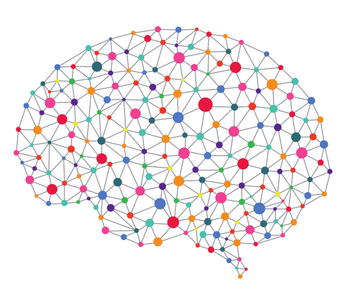

# Neural Nets

It's a simple app based on brain.js as an example working with neural nets.

## [Demo Page](https://frentsel.github.io/neural-nets/)
`Choose the color and look at the result below. Under the input (type color) field should be one of three possible status: light, middle, dark. `